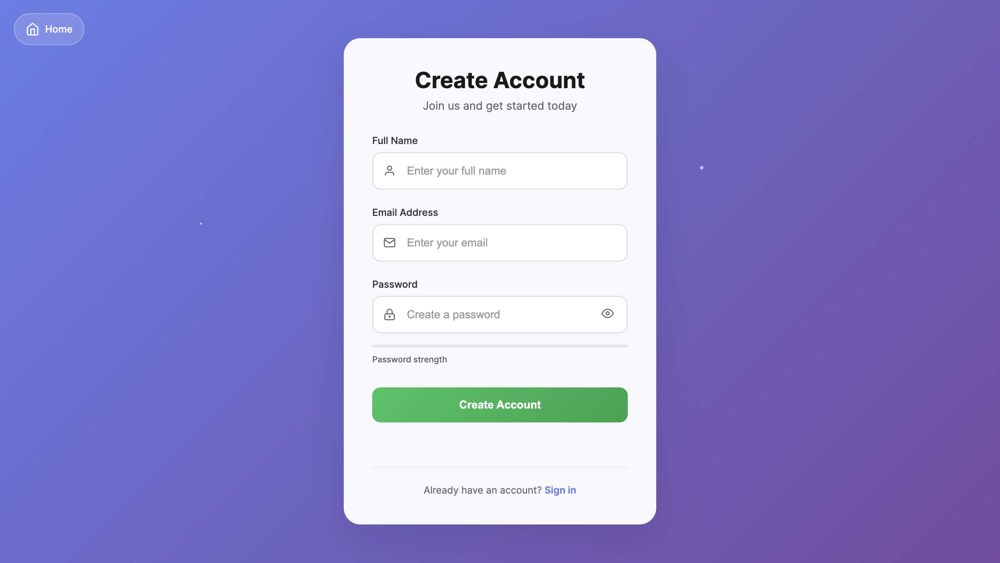
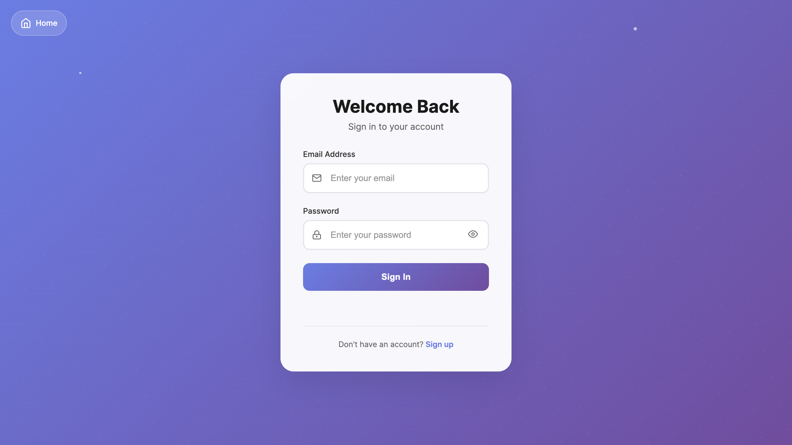

# 🛡️ User Auth System – Mini Project

A lightweight, end-to-end user authentication stack using Node.js, Express, Prisma, and SQLite for the backend, with vanilla HTML/CSS/JS for the frontend.

---

## 🌐 Live Demo

**Try the app here:**  
[https://user-authentication-system-95u2.onrender.com](https://user-authentication-system-95u2.onrender.com)

---

## 🖼️ Screenshot

> Home page


> Register page



> Login page


---

## 📸 Overview

| Stack      | Details                                   |
|------------|-------------------------------------------|
| Server     | Node.js 20, Express 4                     |
| Database   | SQLite via Prisma ORM                     |
| Auth       | bcryptjs (hashing) + JWT (stateless)      |
| Front-end  | Static HTML/CSS/JS served by Express      |
| Scope      | Register / Login                          |

---

## 🚀 Quick Start (Local only)

```bash
# 1. Clone & enter
git clone <repo-url>
cd user-auth-system

# 2. Install dependencies
npm install

# 3. Environment setup
echo "DATABASE_URL=file:./dev.db
JWT_SECRET=$(node -e \"console.log(require('crypto').randomBytes(32).toString('hex'))\")" > .env

# 4. Database setup
npx prisma migrate dev --name init
npx prisma generate

# 5. Run the development server
npm run dev
# → Visit http://localhost:4000
```

---

## 📂 Project Structure

```
src/
├── server.js              # Express entry point
├── auth/
│   ├── register.js        # POST /api/auth/register
│   └── login.js           # POST /api/auth/login
└── prisma/schema.prisma   # Prisma schema
frontend/
├── index.html             # Home page (Register / Login buttons)
├── register.html          # Registration form
└── login.html             # Login form
```

---

## 🔐 API Endpoints

| Method | Endpoint              | Body                                      | Response                       |
|--------|-----------------------|-------------------------------------------|--------------------------------|
| POST   | /api/auth/register    | { username, useremail, userpassword }     | 201 { message, user }          |
| POST   | /api/auth/login       | { email, password }                       | 200 { token, user }            |

- Passwords are hashed with bcrypt (10 rounds).
- JWT tokens expire in 1 hour.

---

## 🧪 Manual Test

```bash
# Register
curl -X POST http://localhost:4000/api/auth/register \
  -H 'Content-Type: application/json' \
  -d '{"username":"alice","useremail":"a@mail.com","userpassword":"secret123"}'

# Login
curl -X POST http://localhost:4000/api/auth/login \
  -H 'Content-Type: application/json' \
  -d '{"email":"a@mail.com","password":"secret123"}'
```

---

## ✅ Features

- Registration with duplicate-email check
- Secure password hashing & JWT issuance
- Stateless authentication—no server-side sessions
- Responsive static UI served by Express
- Ready for quick DB swap (e.g., PostgreSQL: just change `DATABASE_URL`)